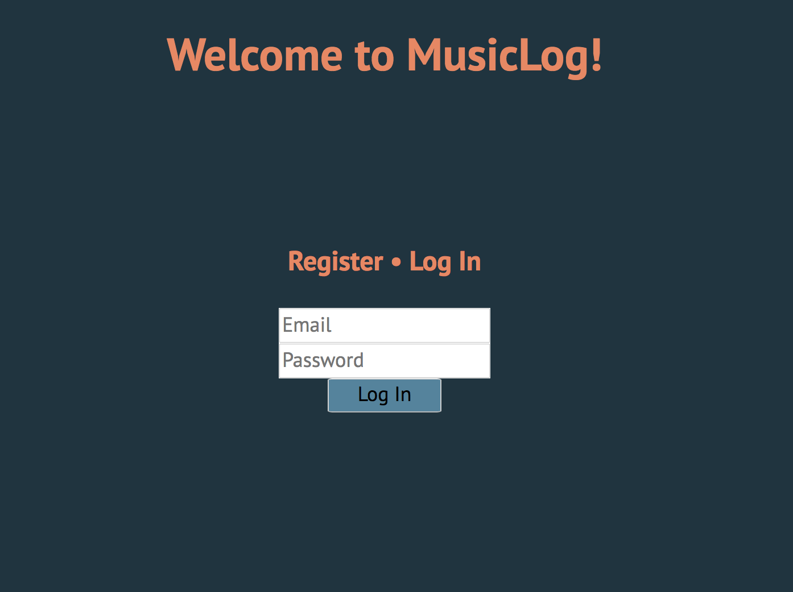
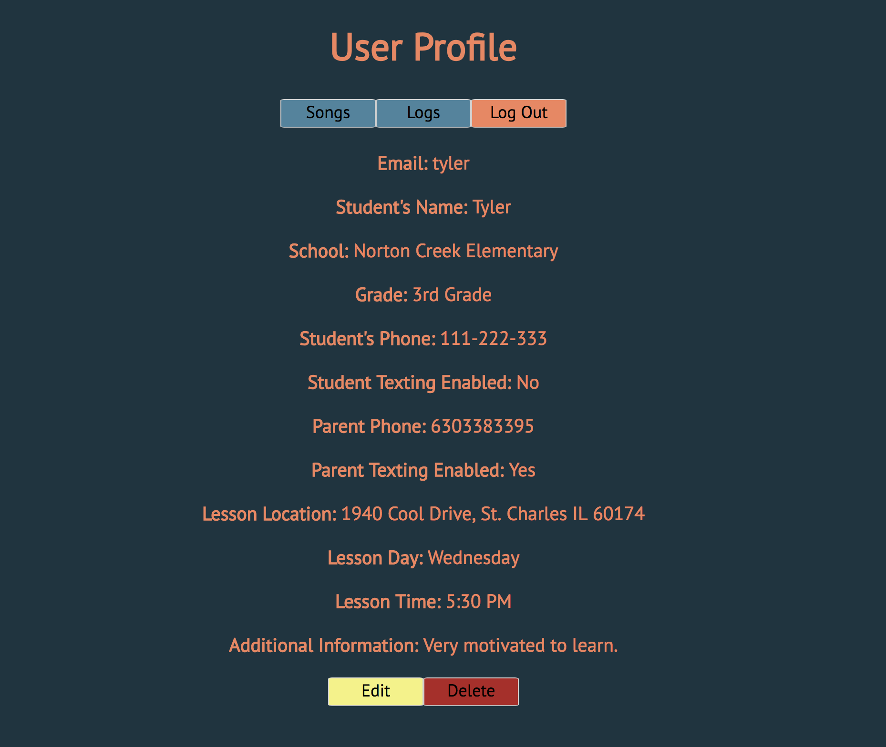
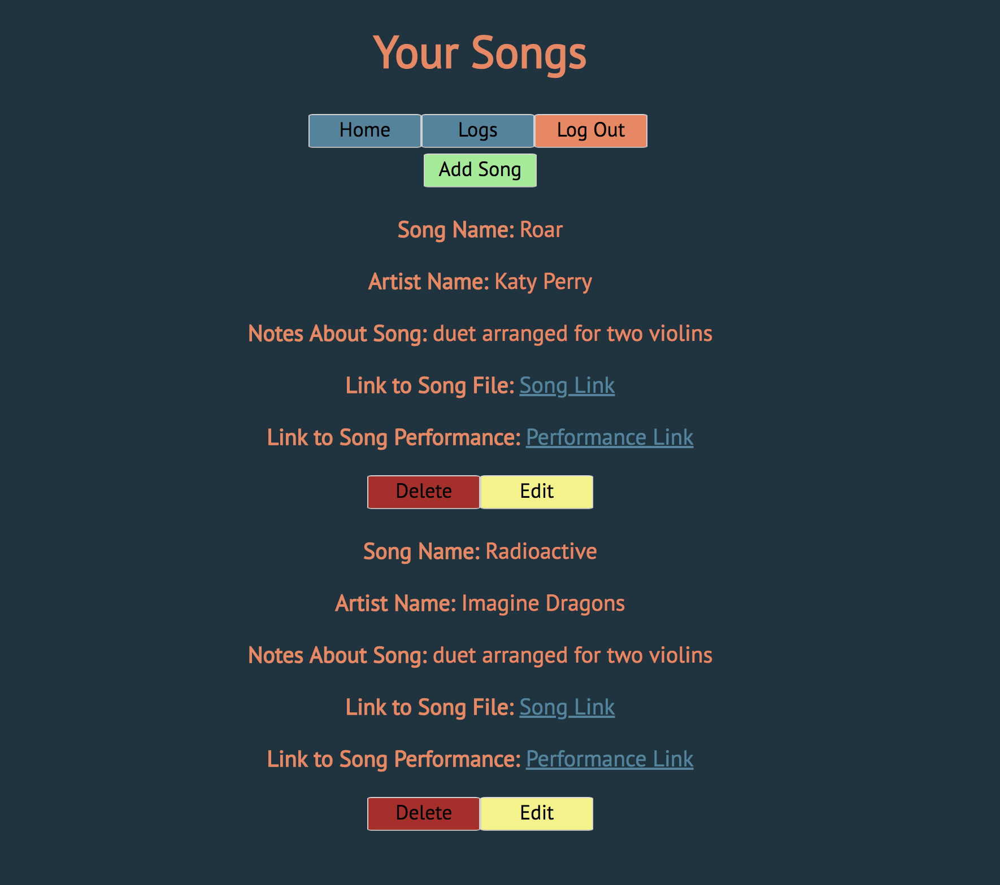
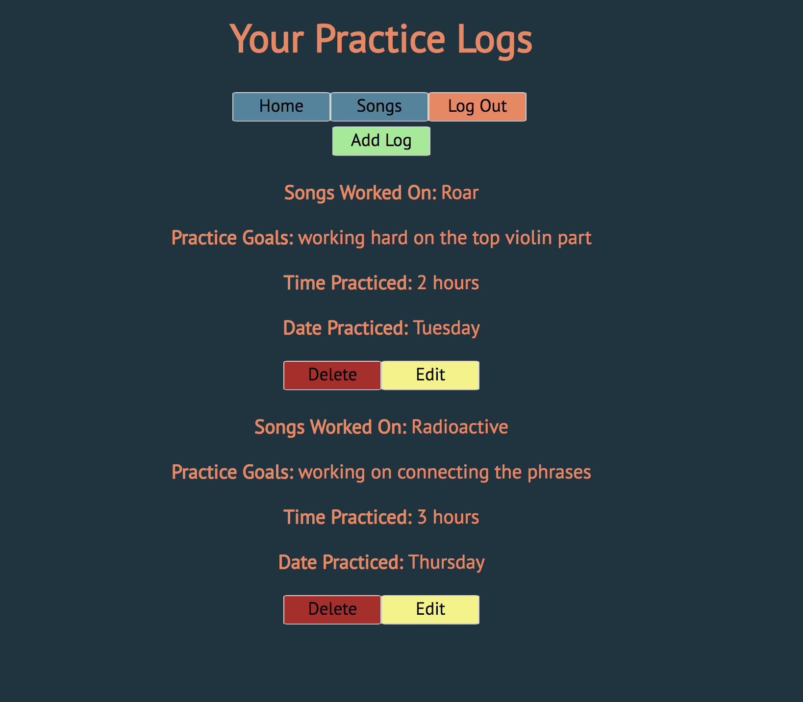
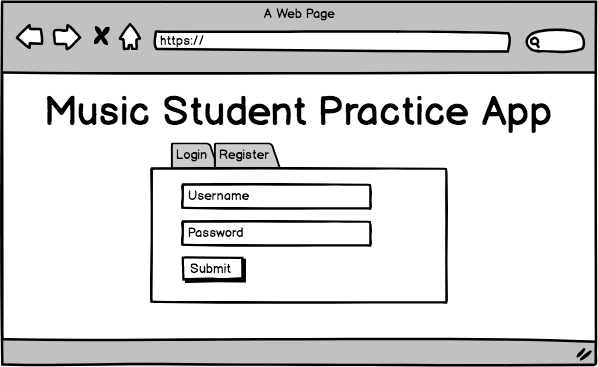
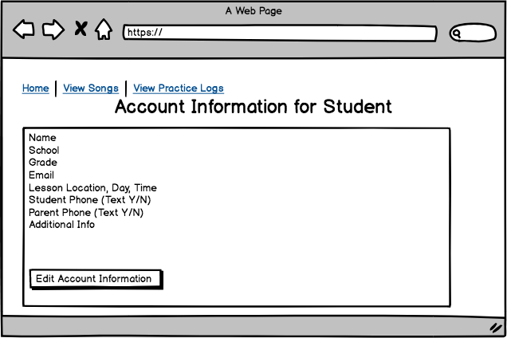
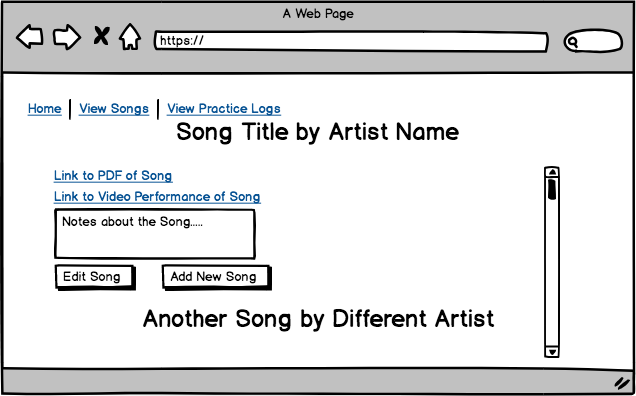
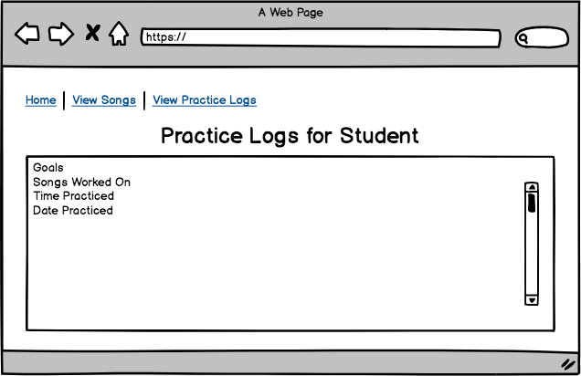

# MusicLog

My final project, MusicLog, for my Web Development Immersive at General Assembly. An application that helps music students organize their music and keep everything stored in one convenient location.

## USER STORY

- Students will be able to log in and see copies of their music (for now, they will be linked as a Google document). 

- Students will be able to see when their lessons are and plan accordingly.

- Students will be able to add a link to an example performance of their music to study from.

- Students will be able to add practice logs to set goals for themselves and keep themselves accountable between lessons.

- Students will be able to edit their contact information if it changes.

## SCREENSHOTS

### LOGIN/REGISTER

### LANDING PAGE

### SONGS VIEW

### PRACTICE LOGS VIEW

## WIREFRAMES

### LOGIN/REGISTER 

### LANDING PAGE

### SONGS VIEW

### PRACTICE LOGS VIEw
